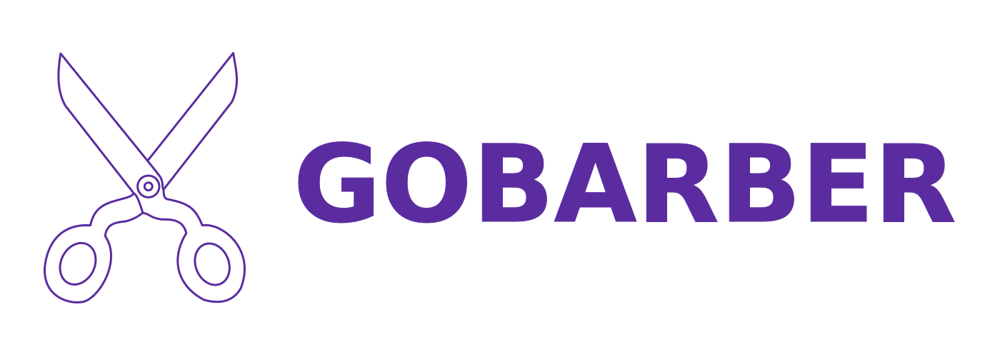
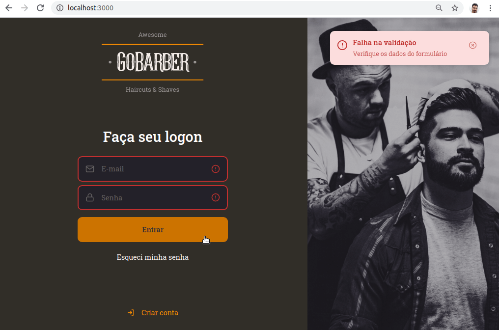

<p align="center"></p>

# GoBarber Front-end

<p align="center">Autor: Jobson Gilberto Barros Amorim &lt;jobsonita@gmail.com&gt;</p>

Baseado nas aulas do curso [GoStack](https://rocketseat.com.br/gostack) (turma 11) da Rocketseat.

<p align="center"></p>

## Sobre este projeto

Este projeto é um front-end em ReactJS usando as bibliotecas react, typescript e styled-components.

Este repositório continua o desenvolvimento do front-end web iniciado em [jobsonita/rocketseat-bootcamp-nivel03-modulo02](https://github.com/jobsonita/rocketseat-bootcamp-nivel03-modulo02).

Para maiores detalhes sobre o passo-a-passo da configuração do projeto, utilize a seção "Comandos utilizados na construção do projeto" deste readme em conjunto com o detalhamento dos [commits](https://github.com/jobsonita/rocketseat-bootcamp-nivel05-modulo01/commits/master) deste repositório.

Este projeto deve ser utilizado em conjunto com o back-end desenvolvido ao longo do GoStack. Atualmente, a versão mais recente compatível com este projeto pode ser encontrada em [jobsonita/rocketseat-bootcamp-nivel04-modulo03](https://github.com/jobsonita/rocketseat-bootcamp-nivel04-modulo03/tree/nivel05-modulo01).

## Dependências Globais

É necessário ter [Node](https://github.com/nvm-sh/nvm) e [Yarn](https://yarnpkg.com) instalados.

## Bibliotecas e ferramentas utilizadas

- react
- typescript
- eslint + prettier (padronização de código)
- styled-components (estilização de componentes)
- polished, react-spring, react-icons (estilizações adicionais)
- unform (controle otimizado de forms)
- yup (validação de dados)
- axios (requisições HTTP REST)
- react-router-dom (roteamento de páginas)
- [VS Code](https://code.visualstudio.com) (editor de código preferido)

## Instalação e execução

Certifique-se de que o back-end da aplicação esteja rodando (siga os passos do [readme do back-end](https://github.com/jobsonita/rocketseat-bootcamp-nivel02-modulo02/blob/master/readme.md)).

Com um terminal aberto na raiz do projeto, execute:

```
yarn
```

Após a instalação, execute:

```
yarn start
```

Finalmente, navegue até o endereço http://localhost:3000

## Comandos utilizados na construção do projeto

Caso deseje criar um projeto similar, listo abaixo os comandos executados nesta segunda parte do projeto. Este projeto utiliza como base o projeto [jobsonita/rocketseat-bootcamp-nivel03-modulo02](https://github.com/jobsonita/rocketseat-bootcamp-nivel03-modulo02).

### Sessão 03

#### Aula 04

```
yarn add react-day-picker
```
